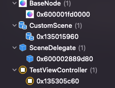

# SpriteKitConcurrencyBug
This project reproduce bug with async await run action in SpriteKit. 


We noticed when you call scene.removeAllActions() before some run action are finished we got memory leak. 
Steps to reproduce: 
1. run app
2. tap 'Reproduce bug' button
3. Tap on the back button
4. check memory:



Proposed solutions:
Call when controller need to be removed:
```
    // First solution thanks to Jure Lajlar
    public func firstWorkAround() {
        scene.isPaused = false
        scene.children.filter { $0 is SKAudioNode }.forEach { $0.run(.stop()) }
        scene.run(.fadeOut(withDuration: 0.1))
        scene.speed = 10000
    }
```

Second approach:
Store all CheckedContinuation run actions:

```
    func runAction(_ action: SKAction) async {
        let key = UUID().uuidString
        await withCheckedContinuation { [weak self] (c: CheckedContinuation<Void, Never>) in
            self?.continuations[key] = c

            self?.run(action) { [weak self] in
                c.resume()
                self?.continuations[key] = nil
            }
        }
    }
 ```
    
Removing when don't need:

```
    // Second solution thanks to Jure Lajlar
    public func secondWorkAround() {
        scene.children.forEach { node in
            if let baseNode = node as? BaseNode {
                baseNode.removeAllActions()
            }
        }
    }
```


